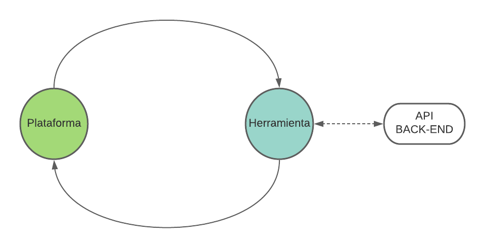
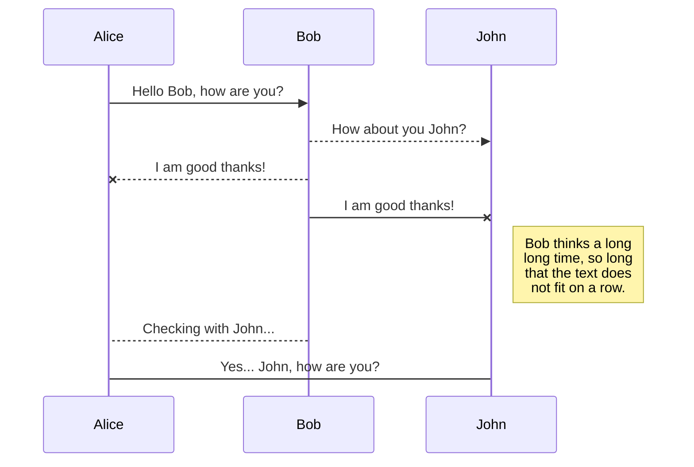
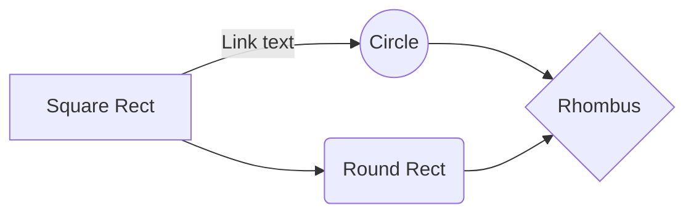

# Integracion de una herramienta

El sistema wirin Permite integrar cualquier herramienta externa que sea capaz de funcionar con la api web Window.


## Componentes para la integracion

Actualmente las herramientas se integran a traves de una estructura de componentes que le permiten realizar ciertas acciones a la herramienta y la plataforma.Esta se divide en el componente vista, navbar, buttonbar y el de integracion el cual suele tener el nombre de la herramienta a integrar.

- **Componente vista**: Es aquel componente que se encarga de mostrar la vista de la integracion de una herramienta a un usuario final. Este componente contiene a todos los componentes que seran nombrados.
- **Componente navbar**: Este componente es una barra de navegacion la cual se usa a traves de la mayor parte de la plataforma y tiene como proposito el asistir al usuario, ya sea para volver a la vista anterior o cerrar la sesion.
- **Componente buttonbar**: Es un componente el cual tiene botones predefinidos y se encargan de solicitar ciertas acciones a la herramienta integrada como puede ser guardar o verificar un modelo.
- **Componente de integracion**: Este componente se encarga de cargar la herramienta integrada la cual lo hace mediante iframe. Este ademas integra otro componente el cual hace un papel de controlador y mensajero entre la herramienta y la plataforma.

>Todos los componentes anteriores a excepcion del componente vista(se recomienda crear un nuevo componente para mantener la estructura de archivos y rutas), pueden ser reutilizados mediante mixins o vueltos a crear, siempre y cuando se cumpla el proposito de la plataforma.

## Componente mensaje
El Componente mensaje Juega un papel muy importante en la plataforma, este es controlador y a su vez mensajero.Este en su papel de mensajero se encarga de realizar la comunicacion entre la plataforma y la herramienta integrada mediante la api web window especificamente usando el metodo [postMessage()](https://developer.mozilla.org/en-US/docs/Web/API/Window/postMessage) y en su papel de controlador se encarga de decidir que hacer con los mensajes entrantes y cuales son los mensajes salientes.
### Estructura de los mensajes
Con el proposito de hacer mas facil el proceso de orquestar los mensajes entre la plataforma y las herramientas, se decidio crear una estructura de mensajes:
#### Mensajes de envio
- Mensajes basico: 
	
    ```json
    {
    "idm":4,
    "state":"save"
    }
    ```

- Mensaje de envio especial(solo se utiliza al cargar la herramienta integrada):
    ```json
    {
    "ok":true,
    "idm":0,
    "token":"",
    "id":""
    }
    ```
Como se puede ver ambos tipos de mensaje pertenecen a los mensajes de envio y un requisito escencial es que todos los mensajes deben tener un identificador correlativo el cual es **idm**, ademas deben incluir el **state** el cual le permite al programador entender la accion que se requiere o se esta solicitando desde la plataforma.En el caso del segundo mensaje, se considera un mensaje especial ya que solo se suele enviar una vez y tiene como proposito dar la informacion para que la herramienta integrada se puede comunicar con la [API]() de la plataforma Wirin.


|atributo | definicion | valor|
|----------|-----------|------|
|idm| Identificacion unica y correlativa de un mensaje| **numero**|
|state| Identificador(humana) de lo que solicita|**save**,**transform**,**etc**|
|ok|Indica true esta todo correcto|**true, false**|
|token| Token para acceder a la API|hash|
|id|Identificacion del proyecto al cual se esta accediendo|hash
#### Mensajes de recepcion
Estos son los mensajes que se reciben desde la herramienta integrada.
- Estructura de un mensaje de recepcion:
   
    ```json
    {
    "idm":0,
    "state":"charged",
    "actions":"response",
    "message":""
    }
    ``` 
Estos mensajes si bien contienen algunas caracteristicas similares a los mensajes de envio de la plataforma, como los son sus atributos **idm** y **state** estos contienen otros que son escenciales como **actions** y **message**.

|atributo|definicion|valor|
|--|--|--|
|idm| Identificacion unica y correlativa de un mensaje| numero|
|state| Identificador(humana) de lo que solicita|**saved**,**transformed**,**etc**)|
|actions|Le indica al controlador lo que se debe hacer con el mensaje ya que son atributos modificables|**modal**,**response**,**localStorage**|
|message|Indica un mensaje y sea de error o de confimacion|texto|
> En el caso de el atributo actions se pueden crear mas valores posibles dependiendo de lo que requiera el programador que se realize con el mensaje.
## Integrando la herramienta

Como fue descrito anteriormente las herramientas se integran a traves de  [iframe](https://developer.mozilla.org/en-US/docs/Web/HTML/Element/iframe) (lo que quiere decir que las herramientas integradas funcionan externamente a la plataforma pero trabajan junto a la plataforma).Sin embargo al integrarse de esa manera solo se muestra la vista de la herramienta y es ahi cuando el metodo **postMessage()** entra a actuar.
 
La siguiente imagen es una representacion conceptual del flujo de comunicaion entre la plataforma y la herramienta.



Como se ve en la imagen existe solo un flujo entre la plataforma y la herramienta integrada, el cual se inicia cuando la plataforma carga en pantalla la herramienta integrada. Ahi es cuando por primera vez se envia un mensaje desde la herramienta hasta la plataforma informando y solicitando los datos para la comunicacion con la [API]().
> Es escencial que cuando la herramienta este cargada le envie el mensaje a la plataforma para obtener las credenciales.

Luego del primer ciclo en el cual la herramienta obtuvo los datos para comunicarse con la API, continuan los siguientes ciclos en los cuales desde la plataforma se envia un mensaje el cual normalmente seran acciones solicitadas por un usuario(ejemplo:guardar, transformar, etc ).
>Un ejemplo de un ciclo de mensajes es que al oprimir el boton de guardar el usuario, la plataforma le envia un mensaje a la herramienta, esta realiza las acciones solicitadas y le envia una mensaje con la respuesta a la plataforma la cual decidira que hacer con ese mensaje.

- Codigo de ejemplo de envio de mensaje:
    
    El siguiente codigo es un extracto el cual desde el componente **buttonbar** un evento(por ejemplo el usuario oprimio un boton) llama al metodo mensaje, el cual a su vez llama un metodo del componente mensaje. El parametro a enviar en este caso es un numero de identificacion **idm** el cual fue definido por el evento que sucedio.
    ```js
    message(message){
            this.$root.$refs.mensaje.envio_data(message);//se llama a funcion para enviar mensajes de componente mensaje
            },
    ```
    > En el caso de envio data solo acepta numeros los cuales son los **idm**
    
    En continuacion con el evento del codigo anterior, la herramienta integrada y al igual que la plataforma se encuentra a la escucha de mensajes nuevos(o estan preparadas para enviar un nuevo mensaje), en este caso se presenta el codigo de la herramienta, el cual en primera instancia crea un eventListener el cual al recibir el mensaje de la plataforma llama al evento **handleMessage()** y este le entrega el mensaje recibido, el que a su vez es enviado a un controlador de mensajes.
    
    ```js
    window.addEventListener('message', handleMessage, false);

    // message event handler (e is event object) 
    function handleMessage(e) {
        controlador.mensajeRecibido(e.data);
    };
    ```
    > Es responsabilidad del desarrollador filtrar los mensajes(tipos de mensajes y de quien vienen).
    
>Para mas informacion sobre el uso de postmessage() se recomienda visitar [window.postMessage()](https://developer.mozilla.org/en-US/docs/Web/API/Window/postMessage)       

> Para mas informacion sobre como integrarse con la API de wirin visitar[API]()
## Rename a file

You can rename the current file by clicking the file name in the navigation bar or by clicking the **Rename** button in the file explorer.

## Delete a file

You can delete the current file by clicking the **Remove** button in the file explorer. The file will be moved into the **Trash** folder and automatically deleted after 7 days of inactivity.

## Export a file

You can export the current file by clicking **Export to disk** in the menu. You can choose to export the file as plain Markdown, as HTML using a Handlebars template or as a PDF.


# Synchronization

Synchronization is one of the biggest features of StackEdit. It enables you to synchronize any file in your workspace with other files stored in your **Google Drive**, your **Dropbox** and your **GitHub** accounts. This allows you to keep writing on other devices, collaborate with people you share the file with, integrate easily into your workflow... The synchronization mechanism takes place every minute in the background, downloading, merging, and uploading file modifications.

There are two types of synchronization and they can complement each other:

- The workspace synchronization will sync all your files, folders and settings automatically. This will allow you to fetch your workspace on any other device.
	> To start syncing your workspace, just sign in with Google in the menu.

- The file synchronization will keep one file of the workspace synced with one or multiple files in **Google Drive**, **Dropbox** or **GitHub**.
	> Before starting to sync files, you must link an account in the **Synchronize** sub-menu.

## Open a file

You can open a file from **Google Drive**, **Dropbox** or **GitHub** by opening the **Synchronize** sub-menu and clicking **Open from**. Once opened in the workspace, any modification in the file will be automatically synced.

## Save a file

You can save any file of the workspace to **Google Drive**, **Dropbox** or **GitHub** by opening the **Synchronize** sub-menu and clicking **Save on**. Even if a file in the workspace is already synced, you can save it to another location. StackEdit can sync one file with multiple locations and accounts.

## Synchronize a file

Once your file is linked to a synchronized location, StackEdit will periodically synchronize it by downloading/uploading any modification. A merge will be performed if necessary and conflicts will be resolved.

If you just have modified your file and you want to force syncing, click the **Synchronize now** button in the navigation bar.

> **Note:** The **Synchronize now** button is disabled if you have no file to synchronize.

## Manage file synchronization

Since one file can be synced with multiple locations, you can list and manage synchronized locations by clicking **File synchronization** in the **Synchronize** sub-menu. This allows you to list and remove synchronized locations that are linked to your file.


# Publication

Publishing in StackEdit makes it simple for you to publish online your files. Once you're happy with a file, you can publish it to different hosting platforms like **Blogger**, **Dropbox**, **Gist**, **GitHub**, **Google Drive**, **WordPress** and **Zendesk**. With [Handlebars templates](http://handlebarsjs.com/), you have full control over what you export.

> Before starting to publish, you must link an account in the **Publish** sub-menu.

## Publish a File

You can publish your file by opening the **Publish** sub-menu and by clicking **Publish to**. For some locations, you can choose between the following formats:

- Markdown: publish the Markdown text on a website that can interpret it (**GitHub** for instance),
- HTML: publish the file converted to HTML via a Handlebars template (on a blog for example).

## Update a publication

After publishing, StackEdit keeps your file linked to that publication which makes it easy for you to re-publish it. Once you have modified your file and you want to update your publication, click on the **Publish now** button in the navigation bar.

> **Note:** The **Publish now** button is disabled if your file has not been published yet.

## Manage file publication

Since one file can be published to multiple locations, you can list and manage publish locations by clicking **File publication** in the **Publish** sub-menu. This allows you to list and remove publication locations that are linked to your file.


# Markdown extensions

StackEdit extends the standard Markdown syntax by adding extra **Markdown extensions**, providing you with some nice features.

> **ProTip:** You can disable any **Markdown extension** in the **File properties** dialog.


## SmartyPants

SmartyPants converts ASCII punctuation characters into "smart" typographic punctuation HTML entities. For example:

|                |ASCII                          |HTML                         |
|----------------|-------------------------------|-----------------------------|
|Single backticks|`'Isn't this fun?'`            |'Isn't this fun?'            |
|Quotes          |`"Isn't this fun?"`            |"Isn't this fun?"            |
|Dashes          |`-- is en-dash, --- is em-dash`|-- is en-dash, --- is em-dash|


## KaTeX

You can render LaTeX mathematical expressions using [KaTeX](https://khan.github.io/KaTeX/):

The *Gamma function* satisfying $\Gamma(n) = (n-1)!\quad\forall n\in\mathbb N$ is via the Euler integral

$$
\Gamma(z) = \int_0^\infty t^{z-1}e^{-t}dt\,.
$$

> You can find more information about **LaTeX** mathematical expressions [here](http://meta.math.stackexchange.com/questions/5020/mathjax-basic-tutorial-and-quick-reference).


## UML diagrams

You can render UML diagrams using [Mermaid](https://mermaidjs.github.io/). For example, this will produce a sequence diagram:



And this will produce a flow chart:

